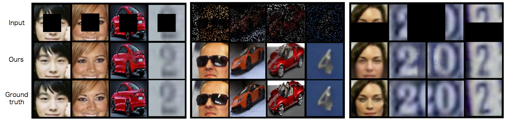
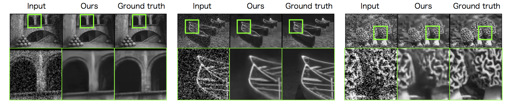

# Exploiting the Potential of Standard Convolutional Autoencoders for Image Restoration by Evolutionary Search

This repository contains the code for the following paper [arXiv](https://arxiv.org/abs/1803.00370):

Masanori Suganuma, Mete Ozay, and Takayuki Okatani, "Exploiting the Potential of Standard Convolutional Autoencoders for Image Restoration by Evolutionary Search," arXiv:1803.00370, (2018)

Sample results on inpainting tasks: 



Sample results on denoising tasks: 




## Requirement

* Ubuntu 14.04 LTS
* CUDA version 8.0
* Python version 3.6.2
* Pytortch version 0.2.0_4


## Usage

### Run the architecture search (denoising)

```shell
python exp_main.py -i
```

### Run the architecture search (inpainting)

```shell
python exp_main.py -i -mask center
```

When you specify the `-i` option, an initial individual consists of a single convolution layer and a single deconvolution layer.
To choose inpainting tasks, please specify the `-mask` option (center, pixel, half).


When you use the multiple GPUs, please specify the `-g` option (default:1):

```shell
python exp_main.py -g 2
```

You can set the number of offsprings with the `-l` option (default:2):

```shell
python exp_main.py -l 4
```


After the execution, the files, `network_info.pickle` and `log_cgp.txt` will be generated. The file `network_info.pickle` contains the information for Cartegian genetic programming (CGP) and `log_cgp.txt` contains the log of the optimization and discovered CAE architecture's genotype lists.

Some parameters (e.g., # rows and columns of CGP, and # epochs) can easily change by modifying the arguments in the script `exp_main.py`.


### Re-training (fine-tuning)

To re-train the discovered architecture:

```shell
python exp_main.py -m retrain
```

### Re-evolution

To re-start the evolution:

```shell
python exp_main.py -m reevolution
```


### Dataset

The CelebA dataset is available [here](http://mmlab.ie.cuhk.edu.hk/projects/CelebA.html).

The cars dataset is available [here](http://ai.stanford.edu/~jkrause/cars/car_dataset.html).

The SVHN dataset is available [here](http://ufldl.stanford.edu/housenumbers/).

The BSDS500 dataset is available [here](https://www2.eecs.berkeley.edu/Research/Projects/CS/vision/bsds/).

To create the training, validation, and test sets of the CelebA dataset, please download "Align&Cropped Images" and save them to `celebA_org`, and "list_landmarks_landmarks_align_celeba.txt" from [here.](http://mmlab.ie.cuhk.edu.hk/projects/CelebA.html) 
Then please run following code:

```shell
python create_data.py
```


